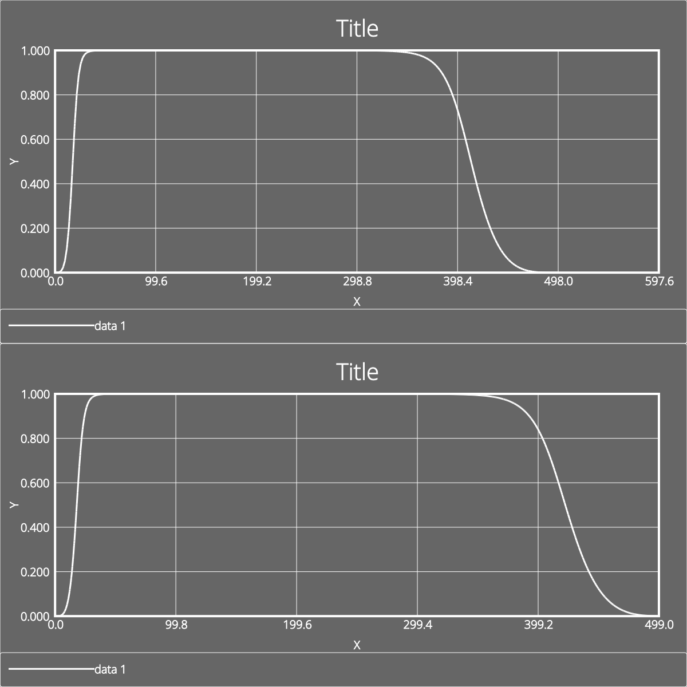

# Заготовка для экспериментов с БИХ фильтрами

* Расчитываем фильтр
* Строит АЧХ по коэффициентам
* Строит АЧХ с помощью БПФ (библиотека FFTW)
* Генерируем код фильтра

## Пример сгенерированной АЧХ

 

Пример сгенерированной программы:
'
'double wz0[4] = {0};
double wz1[4] = {0};
const double B0[4] ={ 0.362769,1,1,1 };
const double B1[4] ={ 0.725538,-2,2,-2 };
const double B2[4] ={ 0.362769,1,1,1 };
const double A0[4] ={ 1,1,1,1 };
const double A1[4] ={ 1.32516,-1.89581,1.02414,-1.77191 };
const double A2[4] ={ 0.641934,0.911044,0.286084,0.787043 };
double step(double x)
{
double y;
for (int i = 0; i < 4; ++i) {
// Direct form II transposed
y = B0[i] * x + wz0[i];
wz0[i] = B1[i] * x - A1[i] * y + wz1[i];
wz1[i] = B2[i] * x - A2[i] * y;
x = y;
}
return y;
}
'

